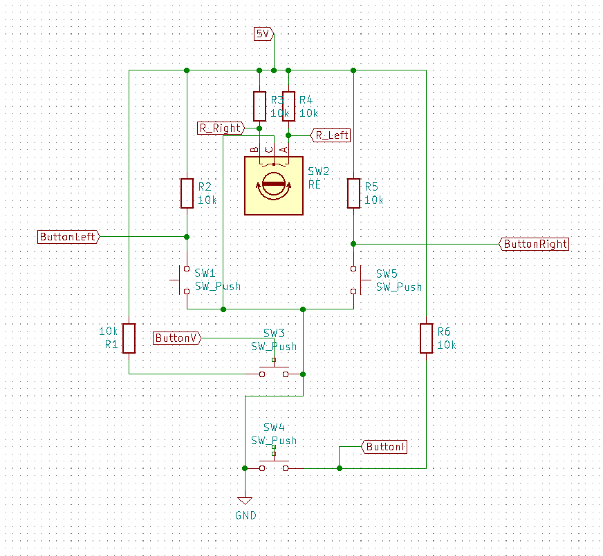
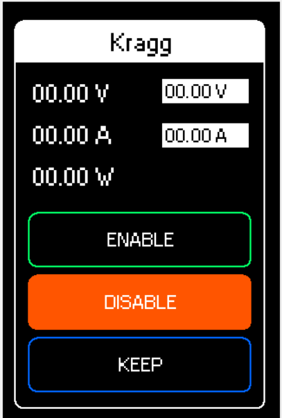
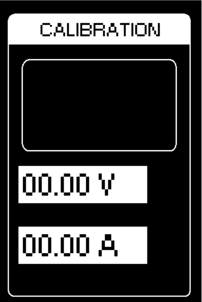

# 485 Lab PS
This repository contains code and instructions of how to convert the 485 AC-DC converter into a configurable lab bench power supply.

## Table of contents
* [General info](#general-info)
* [Hardware and Technologies](*hardware-and-technologies)
* [Setup](#setup)

## General info

This was a project to convert a AC-DC converter to a lab bench power supply unit. It utilizes a Raspberry Pi with a display which runs the GUI. It sends the users input to the 485 via CAN protocol. 

## Hardware and Technologies
The hardware needed for this project is:

* A Raspberry Pi 4/3 (or Zero if it could work)
* A 16 GB SD card
* A SPI-CAN extension, like this [one](https://www.electrokit.com/produkt/can-bus-modul-mcp2515-tja1050-spi/).
* [This LCD](https://www.electrokit.com/produkt/3-5-tft-display-for-raspberry-pi-med-touch/).
* One rotary encoder.
* Four buttons.
* Six 10kΩ resistors.
* The box which can be printed from the included STL-files.

The needed software:
* Python 3.10 and the dependencies listed in 'requirements.txt'
* A copy of Raspbian available from the [Raspberry Pi imager](https://www.raspberrypi.com/software/)

* If the setup file does not install Pillow, write the following line in the terminal to install it manually:
```
python3 -m pip install --upgrade
```


## Setup

Begin by downloading the Raspberry Pi imager from the software page on their website. Then, insert the SD card into your computer and choose the 32-bit OS and write it to the SD. 

Now, insert the SD-card into the Raspberry PI and hook it up to a monitor in order to configure it. Choose a password and use *pi* as username. 

After it has been set up correctly, open the terminal and write:
```shell
git clone https://github.com/felixnordgren11/kragg
```
This will clone the repository into /home/pi.
Then you will have to type in the following commands:

```shell
cd kragg

chmod +x lcd.sh

./lcd.sh
```
Respond with a 'y' and then press enter when prompted, this will run the last file and reboot the system.
#
When the system has booted up again, open the terminal and type (in order):
```shell
cd kragg

chmod +x setup.sh

./setup.sh
```
to enter the kragg folder, make the setup.sh file executable and then run it. When told, enter 1 and press 'Enter' to run the last file and reboot the system.


## Build and GPIO connections


### GPIO connections (pin numbers found here: https://pinout.xyz/#):
* 1-26 is occupied by the touch screen.

#### Connections for buttons and rotary encoder

* Pin 27 (GPIO 0):  Rotary left
* Pin 28 (GPIO 1):  Rotary right
* Pin 29 (GPIO 5):  Button Left
* Pin 30 (Ground):  Empty
* Pin 31 (GPIO 6):  Button Right
* Pin 32 (GPIO 12): Voltage Button
* Pin 33 (GPIO 13): Current Button
* Pin 34 (Ground):  Empty

#### Connections for CAN bus

* Pin 35 (GPIO 19): MISO
* Pin 36 (GPIO 16): CS
* Pin 37 (GPIO 26): INT
* Pin 38 (GPIO 20): MOSI
* Pin 39 (Ground):  GND
* Pin 40 (GPIO 21): SCK


The VCC pin on the CAN bus has to be connected to a 5 V power source pin, but the screen occupies both of the Raspberry Pi's 5 V pins. Instead, a cable needs to be cut, branched and soldered/crimped so that the CAN bus can get power from the same source as the computer.

(Old Button-pin layout, 2nd build, from top to bottom:
1. Rotary right
2. Rotary left
3. Button Current
4. Button Right
5. Button Voltage
6. Button Left
)


(New Button-pin layout, 2nd build, from top to bottom:
1. Rotary Right
2. Rotary Left
3. Button Right
4. Button Left
5. Button Voltage
6. Button Current
)

### The key pad.

The key pad has the following schematic



Where R_left/right are the connections from the rotary encoder. These pins are connected to the Raspberry Pi as specified above.

A physical realization of the key pad may (should) look as follows:


#### Measurements
The construction of the key pad may follow a somewhat unscientific procedure. 

1. Take a prototyping PCB such as the one in the picture above. 
2. Cut it so that it is at least 44 mm wide, 59 mm tall and at most 48 mm wide, 80 mm tall.

3. 
    * Add two voltage rails as shown in picture, one for 5V, one for GND.
    * Mount the rotary encoder in the middle of the board, nine rows of holes from the top.
    * Then, mount the two buttons (centered) 16 rows down and each at three rows from the middle.
    * Now mount the V button in the middle, five rows below the previous two buttons. 
    * Finally mount the last button six rows below the last.
4. Now attach all pins according to the schematic. 
5. Connect wires from Raspberry Pi to key pad according to schematic, ideally via a header as shown in the picture (top left).
6. Done!

## Housing

Below are pictures of the designed housing:

** a picture **

## GUI
Below are the two screens available in the GUI.



Above is the main screen, here all values that the power unit are measuring are displayed.
The left column are the measured values and the right columns is the set limits. One can set them by pressing the V and I buttons on the key pad and then setting precision with the ">", "<" buttons. The set value is increased or decreased with the rotary encoder.



If the I and V buttons are pressed simultaneously for three seconds, the device will enter calibration mode. This means that the user will be able to calibrate tha power supply to show the measured voltage at a point of the users choosing. 
You will need a multimeter as the program will prompt you to set the output using the rotary encoder so as to match the displayed values on the screen. A load will also be needed as the device need to measure voltages for different currents.